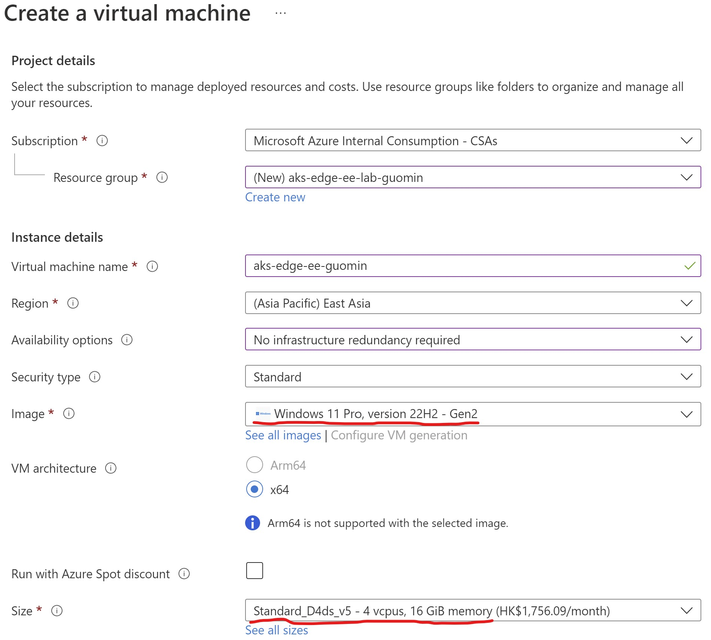
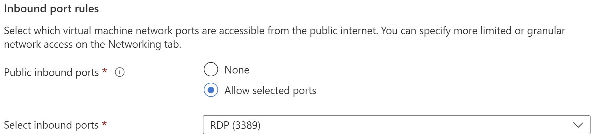

# AKS Edge Essentials Installation 

## Lab Overview  
In this lab, you will begin by reviewing the AKS EE's deployment prerequisites and setup the machine to start the deployment. You will need to download and install the k8s or k3s installer for AKS EE, then use the deployment CLI with configuration to complete single machine deployment on Azure VM or physical machine, or multiple node cluster deployment on physical machine.   
  
In summary, the lab includes the following exercises:  
* Review the hands on Lab Prerequisites
* Install AKS EE k8s/k3s installer on each node
* Implement Single machine deployment in a Azure VM
* Extend: Implement full deployment with multiple nodes

## Lab Prerequisites
* Hardware requirements  

| Specs | Requirement                |
| :------------- | :--------------------------- |
| Memory | 4 GB at least 2 GB free (cluster-only), 8 GB (Arc and GitOps) |
| CPU       | Two logical processors, clock speed at least 1.8 GHz |
| Disk space        | At least 14 GB free |
| Host OS        | Windows 10/11 IoT Enterprise/Enterprise/Pro and Windows Server 2019, 2022 |

## Lab Instructions

### Exercise 1: Setup your machine and install AKS Edge Essentials (ower: Guomin)

In this lab, we will use Azure virtual machine to do a single machince setup and deployment.

#### Step 1: Create a Azure virtual machine with WIndows 11 Pro installed.  
  
1. Sign in to Azure  
Sign in to Azure portal at: https://portal.azure.com.

2. In Azure portal, click **Create a resource**, select **Create** in the **Virtual machine** to open the **Create a virtual machine** page

3. Create the VM with below settings  

    

* **Resource group**: your resource group name, ex: aks-edge-ee-lab-< your name >
* **Virtual machine name**: your vm name, ex: aks-edge-ee-< your name >
* **Region**: your Azure region.
* **Image**: Use the **Windows 11 Pro, version 22H2 - Gen2**
* **Size**: Use the **Stardard D4ds_v5 - 4vcpus, 16GB memory**  

    And allow inbound rules for RDP connection as below

    

    Select **Review + Create** button at the bottom of the page to create virtual machine.

#### STEP 2: Connect into the Windows 11 Pro virtual machine  
1. Once the virtual machine is created, go to the **Overview** page, select **Connect** then **RDP** to download the RDP file to your local machine.
2. Double click the downloaded RDP file to connect into the virtual machine.

#### STEP 3: Enable Hyper-V features for Windows

1. Open a PowerShell console as Administrator, run following command:  
    ```bash
    Enable-WindowsOptionalFeature -Online -FeatureName Microsoft-Hyper-V -All
    ```

2. check if Hyper-V is enabled using following command:
    ```bash
    Get-WindowsOptionalFeature -Online -FeatureName *hyper*
    ```

#### STEP 4: Install K8S or K3S in Windows 11 Pro
  
  
  
## Execise 2: Implment single machine deployment

You can run the New-AksEdgeDeployment cmdlet to deploy a single-machine AKS Edge cluster with a single Linux control-plane node, however we need to pass ServiceIpRangeSize = 10, which is not a default option. On single machine clusters, if you deployed your Kubernetes cluster without specifying a -ServiceIPRangeSize, you will not have allocated IPs for your workload services and you won't have an external IP address. Hence we will use the JSON object and pass it as a string:

```bash
$jsonString = New-AksEdgeConfig -outFile .\mydeployconfig.json
$jsonObj = $jsonString | ConvertFrom-Json 
$jsonObj.EndUser.AcceptEula = $true
$jsonObj.EndUser.AcceptOptionalTelemetry = $true
$jsonObj.LinuxVm.CpuCount = 4
$jsonObj.LinuxVm.MemoryInMB = 4096
$jsonObj.Network.ServiceIpRangeSize = 10

New-AksEdgeDeployment -JsonConfigString ($jsonObj | ConvertTo-Json)
 ```

Confirm that the deployment was successful by running:

```bash
kubectl get nodes -o wide
kubectl get pods -A -o wide
 ```